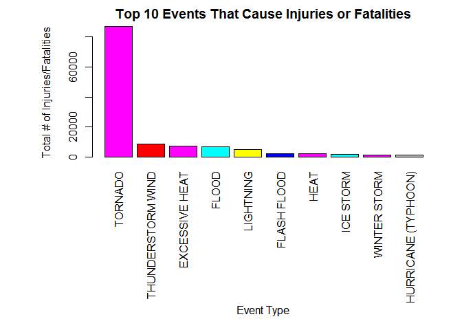

# NOAA Storm Data Analysis

##Synopsis
In this report we show which weather events have a greatest impact to injury and health as well as the greatest economic impact overall for the United States. In order to investigate this hypothesis we have gathered the data from [U.S. National Oceanic and Atmospheric Administration's (NOAA) storm database.](http://www.ncdc.noaa.gov/stormevents/) The events in the database start in the year 1950 and end in November 2011. This database tracks characteristics of major storms and weather events in the United States, including when and where they occur, as well as estimates of any fatalities, injuries, and property damage. Based on the details captured on the [NOAA website](http://www.ncdc.noaa.gov/stormevents/details.jsp) only data from 1996 onwards will be studied. This is to stop bias from being introduced into the data. From this data taking the top 10 events, we found Tornado's are major danger to public health as it results in more fatalities and Injuries. Flood events on the other hand have had major impact on economy of the United States.


#Loading and Preprocessing the NOAA Storm Data

###Get and load the data
This section gets and loads the required data. If the data already has already been downloaded, the data is not downloaded again.

```r
# set the url path for the download 
fileUrl <- "https://d396qusza40orc.cloudfront.net/repdata%2Fdata%2FStormData.csv.bz2"

#set the working directory
setwd("~/R/RepData_PeerAssessment2")

# set up some working variables. These can be changed depending on your requirements
workingDir = getwd()
dataDir = "data"
fileName = "data/StormData.csv.bz2"


# create a data directory if one does not exist directory
if (!file.exists(dataDir)){
  dir.create(file.path(workingDir, dataDir))
}

# This setting is used to for https connections. Windows machine no curl installed
setInternet2(use = TRUE) #This needs to be set to support https. Could not use curl as not installed

if (!file.exists(fileName)){
  
  # download into the data directory
  download.file(fileUrl, fileName, method = "auto")
}


# load the csv in data frame
rawStormData <- read.csv(fileName, as.is=TRUE)
```

###Check the dataset

Check the first few rows of the dataset

```r
head(rawStormData)
```

```
##   STATE__           BGN_DATE BGN_TIME TIME_ZONE COUNTY COUNTYNAME STATE
## 1       1  4/18/1950 0:00:00     0130       CST     97     MOBILE    AL
## 2       1  4/18/1950 0:00:00     0145       CST      3    BALDWIN    AL
## 3       1  2/20/1951 0:00:00     1600       CST     57    FAYETTE    AL
## 4       1   6/8/1951 0:00:00     0900       CST     89    MADISON    AL
## 5       1 11/15/1951 0:00:00     1500       CST     43    CULLMAN    AL
## 6       1 11/15/1951 0:00:00     2000       CST     77 LAUDERDALE    AL
##    EVTYPE BGN_RANGE BGN_AZI BGN_LOCATI END_DATE END_TIME COUNTY_END
## 1 TORNADO         0                                               0
## 2 TORNADO         0                                               0
## 3 TORNADO         0                                               0
## 4 TORNADO         0                                               0
## 5 TORNADO         0                                               0
## 6 TORNADO         0                                               0
##   COUNTYENDN END_RANGE END_AZI END_LOCATI LENGTH WIDTH F MAG FATALITIES
## 1         NA         0                      14.0   100 3   0          0
## 2         NA         0                       2.0   150 2   0          0
## 3         NA         0                       0.1   123 2   0          0
## 4         NA         0                       0.0   100 2   0          0
## 5         NA         0                       0.0   150 2   0          0
## 6         NA         0                       1.5   177 2   0          0
##   INJURIES PROPDMG PROPDMGEXP CROPDMG CROPDMGEXP WFO STATEOFFIC ZONENAMES
## 1       15    25.0          K       0                                    
## 2        0     2.5          K       0                                    
## 3        2    25.0          K       0                                    
## 4        2     2.5          K       0                                    
## 5        2     2.5          K       0                                    
## 6        6     2.5          K       0                                    
##   LATITUDE LONGITUDE LATITUDE_E LONGITUDE_ REMARKS REFNUM
## 1     3040      8812       3051       8806              1
## 2     3042      8755          0          0              2
## 3     3340      8742          0          0              3
## 4     3458      8626          0          0              4
## 5     3412      8642          0          0              5
## 6     3450      8748          0          0              6
```

Check the column names of the activity dataset


```r
names(rawStormData)
```

```
##  [1] "STATE__"    "BGN_DATE"   "BGN_TIME"   "TIME_ZONE"  "COUNTY"    
##  [6] "COUNTYNAME" "STATE"      "EVTYPE"     "BGN_RANGE"  "BGN_AZI"   
## [11] "BGN_LOCATI" "END_DATE"   "END_TIME"   "COUNTY_END" "COUNTYENDN"
## [16] "END_RANGE"  "END_AZI"    "END_LOCATI" "LENGTH"     "WIDTH"     
## [21] "F"          "MAG"        "FATALITIES" "INJURIES"   "PROPDMG"   
## [26] "PROPDMGEXP" "CROPDMG"    "CROPDMGEXP" "WFO"        "STATEOFFIC"
## [31] "ZONENAMES"  "LATITUDE"   "LONGITUDE"  "LATITUDE_E" "LONGITUDE_"
## [36] "REMARKS"    "REFNUM"
```

Check the structure of the activity dataset 

```r
str(rawStormData)
```

```
## 'data.frame':	902297 obs. of  37 variables:
##  $ STATE__   : num  1 1 1 1 1 1 1 1 1 1 ...
##  $ BGN_DATE  : chr  "4/18/1950 0:00:00" "4/18/1950 0:00:00" "2/20/1951 0:00:00" "6/8/1951 0:00:00" ...
##  $ BGN_TIME  : chr  "0130" "0145" "1600" "0900" ...
##  $ TIME_ZONE : chr  "CST" "CST" "CST" "CST" ...
##  $ COUNTY    : num  97 3 57 89 43 77 9 123 125 57 ...
##  $ COUNTYNAME: chr  "MOBILE" "BALDWIN" "FAYETTE" "MADISON" ...
##  $ STATE     : chr  "AL" "AL" "AL" "AL" ...
##  $ EVTYPE    : chr  "TORNADO" "TORNADO" "TORNADO" "TORNADO" ...
##  $ BGN_RANGE : num  0 0 0 0 0 0 0 0 0 0 ...
##  $ BGN_AZI   : chr  "" "" "" "" ...
##  $ BGN_LOCATI: chr  "" "" "" "" ...
##  $ END_DATE  : chr  "" "" "" "" ...
##  $ END_TIME  : chr  "" "" "" "" ...
##  $ COUNTY_END: num  0 0 0 0 0 0 0 0 0 0 ...
##  $ COUNTYENDN: logi  NA NA NA NA NA NA ...
##  $ END_RANGE : num  0 0 0 0 0 0 0 0 0 0 ...
##  $ END_AZI   : chr  "" "" "" "" ...
##  $ END_LOCATI: chr  "" "" "" "" ...
##  $ LENGTH    : num  14 2 0.1 0 0 1.5 1.5 0 3.3 2.3 ...
##  $ WIDTH     : num  100 150 123 100 150 177 33 33 100 100 ...
##  $ F         : int  3 2 2 2 2 2 2 1 3 3 ...
##  $ MAG       : num  0 0 0 0 0 0 0 0 0 0 ...
##  $ FATALITIES: num  0 0 0 0 0 0 0 0 1 0 ...
##  $ INJURIES  : num  15 0 2 2 2 6 1 0 14 0 ...
##  $ PROPDMG   : num  25 2.5 25 2.5 2.5 2.5 2.5 2.5 25 25 ...
##  $ PROPDMGEXP: chr  "K" "K" "K" "K" ...
##  $ CROPDMG   : num  0 0 0 0 0 0 0 0 0 0 ...
##  $ CROPDMGEXP: chr  "" "" "" "" ...
##  $ WFO       : chr  "" "" "" "" ...
##  $ STATEOFFIC: chr  "" "" "" "" ...
##  $ ZONENAMES : chr  "" "" "" "" ...
##  $ LATITUDE  : num  3040 3042 3340 3458 3412 ...
##  $ LONGITUDE : num  8812 8755 8742 8626 8642 ...
##  $ LATITUDE_E: num  3051 0 0 0 0 ...
##  $ LONGITUDE_: num  8806 0 0 0 0 ...
##  $ REMARKS   : chr  "" "" "" "" ...
##  $ REFNUM    : num  1 2 3 4 5 6 7 8 9 10 ...
```


###Transformations and Preprocessing the dataset

Make all the column names lower case. This makes it easier to read and program.

```r
names(rawStormData) <- tolower(make.names(names(rawStormData)))
```

Change the begin date to be a proper date

```r
rawStormData$bgn_date <- as.Date(rawStormData$bgn_date, format="%m/%d/%Y") #Australian date format
```

In the next section we select only the data that is required. Based on the details captured on the [NOAA website](http://www.ncdc.noaa.gov/stormevents/details.jsp) only data from 1996 onwards will be studied. This is to stop bias from being introduced into the data.

```r
stormData <- subset(rawStormData, bgn_date >= as.Date("01-01-1996"), select=c(bgn_date, countyname, state, evtype, fatalities, injuries, propdmg, propdmgexp, cropdmg, cropdmgexp))

head(stormData)
```

```
##     bgn_date countyname state  evtype fatalities injuries propdmg
## 1 1950-04-18     MOBILE    AL TORNADO          0       15    25.0
## 2 1950-04-18    BALDWIN    AL TORNADO          0        0     2.5
## 3 1951-02-20    FAYETTE    AL TORNADO          0        2    25.0
## 4 1951-06-08    MADISON    AL TORNADO          0        2     2.5
## 5 1951-11-15    CULLMAN    AL TORNADO          0        2     2.5
## 6 1951-11-15 LAUDERDALE    AL TORNADO          0        6     2.5
##   propdmgexp cropdmg cropdmgexp
## 1          K       0           
## 2          K       0           
## 3          K       0           
## 4          K       0           
## 5          K       0           
## 6          K       0
```

```r
unique(stormData[, "evtype"])
```

```
##   [1] "TORNADO"                        "TSTM WIND"                     
##   [3] "HAIL"                           "FREEZING RAIN"                 
##   [5] "SNOW"                           "ICE STORM/FLASH FLOOD"         
##   [7] "SNOW/ICE"                       "WINTER STORM"                  
##   [9] "HURRICANE OPAL/HIGH WINDS"      "THUNDERSTORM WINDS"            
##  [11] "RECORD COLD"                    "HURRICANE ERIN"                
##  [13] "HURRICANE OPAL"                 "HEAVY RAIN"                    
##  [15] "LIGHTNING"                      "THUNDERSTORM WIND"             
##  [17] "DENSE FOG"                      "RIP CURRENT"                   
##  [19] "THUNDERSTORM WINS"              "FLASH FLOOD"                   
##  [21] "FLASH FLOODING"                 "HIGH WINDS"                    
##  [23] "FUNNEL CLOUD"                   "TORNADO F0"                    
##  [25] "THUNDERSTORM WINDS LIGHTNING"   "THUNDERSTORM WINDS/HAIL"       
##  [27] "HEAT"                           "WIND"                          
##  [29] "LIGHTING"                       "HEAVY RAINS"                   
##  [31] "LIGHTNING AND HEAVY RAIN"       "FUNNEL"                        
##  [33] "WALL CLOUD"                     "FLOODING"                      
##  [35] "THUNDERSTORM WINDS HAIL"        "FLOOD"                         
##  [37] "COLD"                           "HEAVY RAIN/LIGHTNING"          
##  [39] "FLASH FLOODING/THUNDERSTORM WI" "WALL CLOUD/FUNNEL CLOUD"       
##  [41] "THUNDERSTORM"                   "WATERSPOUT"                    
##  [43] "EXTREME COLD"                   "HAIL 1.75)"                    
##  [45] "LIGHTNING/HEAVY RAIN"           "HIGH WIND"                     
##  [47] "BLIZZARD"                       "BLIZZARD WEATHER"              
##  [49] "WIND CHILL"                     "BREAKUP FLOODING"              
##  [51] "HIGH WIND/BLIZZARD"             "RIVER FLOOD"                   
##  [53] "HEAVY SNOW"                     "FREEZE"                        
##  [55] "COASTAL FLOOD"                  "HIGH WIND AND HIGH TIDES"      
##  [57] "HIGH WIND/BLIZZARD/FREEZING RA" "HIGH TIDES"                    
##  [59] "HIGH WIND AND HEAVY SNOW"       "RECORD COLD AND HIGH WIND"     
##  [61] "RECORD HIGH TEMPERATURE"        "RECORD HIGH"                   
##  [63] "HIGH WINDS HEAVY RAINS"         "HIGH WIND/ BLIZZARD"           
##  [65] "ICE STORM"                      "BLIZZARD/HIGH WIND"            
##  [67] "HIGH WIND/LOW WIND CHILL"       "HEAVY SNOW/HIGH"               
##  [69] "RECORD LOW"                     "HIGH WINDS AND WIND CHILL"     
##  [71] "HEAVY SNOW/HIGH WINDS/FREEZING" "LOW TEMPERATURE RECORD"        
##  [73] "AVALANCHE"                      "MARINE MISHAP"                 
##  [75] "WIND CHILL/HIGH WIND"           "HIGH WIND/WIND CHILL/BLIZZARD" 
##  [77] "HIGH WIND/WIND CHILL"           "HIGH WIND/HEAVY SNOW"          
##  [79] "HIGH TEMPERATURE RECORD"        "FLOOD WATCH/"                  
##  [81] "RECORD HIGH TEMPERATURES"       "HIGH WIND/SEAS"                
##  [83] "HIGH WINDS/HEAVY RAIN"          "HIGH SEAS"                     
##  [85] "SEVERE TURBULENCE"              "RECORD RAINFALL"               
##  [87] "RECORD SNOWFALL"                "RECORD WARMTH"                 
##  [89] "HEAVY SNOW/WIND"                "EXTREME HEAT"                  
##  [91] "WIND DAMAGE"                    "DUST STORM"                    
##  [93] "APACHE COUNTY"                  "SLEET"                         
##  [95] "HAIL STORM"                     "FUNNEL CLOUDS"                 
##  [97] "FLASH FLOODS"                   "DUST DEVIL"                    
##  [99] "EXCESSIVE HEAT"                 "THUNDERSTORM WINDS/FUNNEL CLOU"
## [101] "WINTER STORM/HIGH WIND"         "WINTER STORM/HIGH WINDS"       
## [103] "GUSTY WINDS"                    "STRONG WINDS"                  
## [105] "FLOODING/HEAVY RAIN"            "SNOW AND WIND"                 
## [107] "HEAVY SURF COASTAL FLOODING"    "HEAVY SURF"                    
## [109] "HEAVY PRECIPATATION"            "URBAN FLOODING"                
## [111] "HIGH SURF"                      "BLOWING DUST"                  
## [113] "URBAN/SMALL"                    "WILD FIRES"                    
## [115] "HIGH"                           "URBAN/SMALL FLOODING"          
## [117] "WATER SPOUT"                    "HIGH WINDS DUST STORM"         
## [119] "WINTER STORM HIGH WINDS"        "LOCAL FLOOD"                   
## [121] "WINTER STORMS"                  "MUDSLIDES"                     
## [123] "RAINSTORM"                      "SEVERE THUNDERSTORM"           
## [125] "SEVERE THUNDERSTORMS"           "SEVERE THUNDERSTORM WINDS"     
## [127] "THUNDERSTORMS WINDS"            "DRY MICROBURST"                
## [129] "FLOOD/FLASH FLOOD"              "FLOOD/RAIN/WINDS"              
## [131] "WINDS"                          "DRY MICROBURST 61"             
## [133] "THUNDERSTORMS"                  "FLASH FLOOD WINDS"             
## [135] "URBAN/SMALL STREAM FLOODING"    "MICROBURST"                    
## [137] "STRONG WIND"                    "HIGH WIND DAMAGE"              
## [139] "STREAM FLOODING"                "URBAN AND SMALL"               
## [141] "HEAVY SNOWPACK"                 "ICE"                           
## [143] "FLASH FLOOD/"                   "DOWNBURST"                     
## [145] "GUSTNADO AND"                   "FLOOD/RAIN/WIND"               
## [147] "WET MICROBURST"                 "DOWNBURST WINDS"               
## [149] "DRY MICROBURST WINDS"           "DRY MIRCOBURST WINDS"          
## [151] "DRY MICROBURST 53"              "SMALL STREAM URBAN FLOOD"      
## [153] "MICROBURST WINDS"               "HIGH WINDS 57"                 
## [155] "DRY MICROBURST 50"              "HIGH WINDS 66"                 
## [157] "HIGH WINDS 76"                  "HIGH WINDS 63"                 
## [159] "HIGH WINDS 67"                  "BLIZZARD/HEAVY SNOW"           
## [161] "HEAVY SNOW/HIGH WINDS"          "BLOWING SNOW"                  
## [163] "HIGH WINDS 82"                  "HIGH WINDS 80"                 
## [165] "HIGH WINDS 58"                  "FREEZING DRIZZLE"              
## [167] "LIGHTNING THUNDERSTORM WINDSS"  "DRY MICROBURST 58"             
## [169] "HAIL 75"                        "HIGH WINDS 73"                 
## [171] "HIGH WINDS 55"                  "LIGHT SNOW AND SLEET"          
## [173] "URBAN FLOOD"                    "DRY MICROBURST 84"             
## [175] "THUNDERSTORM WINDS 60"          "HEAVY RAIN/FLOODING"           
## [177] "THUNDERSTORM WINDSS"            "TORNADOS"                      
## [179] "GLAZE"                          "RECORD HEAT"                   
## [181] "COASTAL FLOODING"               "HEAT WAVE"                     
## [183] "FIRST SNOW"                     "FREEZING RAIN AND SLEET"       
## [185] "UNSEASONABLY DRY"               "UNSEASONABLY WET"              
## [187] "WINTRY MIX"                     "WINTER WEATHER"                
## [189] "UNSEASONABLY COLD"              "EXTREME/RECORD COLD"           
## [191] "RIP CURRENTS HEAVY SURF"        "SLEET/RAIN/SNOW"               
## [193] "UNSEASONABLY WARM"              "DROUGHT"                       
## [195] "NORMAL PRECIPITATION"           "HIGH WINDS/FLOODING"           
## [197] "DRY"                            "RAIN/SNOW"                     
## [199] "SNOW/RAIN/SLEET"                "WATERSPOUT/TORNADO"            
## [201] "WATERSPOUTS"                    "WATERSPOUT TORNADO"            
## [203] "URBAN/SMALL STREAM FLOOD"       "STORM SURGE"                   
## [205] "WATERSPOUT-TORNADO"             "WATERSPOUT-"                   
## [207] "TORNADOES, TSTM WIND, HAIL"     "TROPICAL STORM ALBERTO"        
## [209] "TROPICAL STORM"                 "TROPICAL STORM GORDON"         
## [211] "TROPICAL STORM JERRY"           "LIGHTNING THUNDERSTORM WINDS"  
## [213] "WAYTERSPOUT"                    "MINOR FLOODING"                
## [215] "LIGHTNING INJURY"               "URBAN/SMALL STREAM  FLOOD"     
## [217] "LIGHTNING AND THUNDERSTORM WIN" "THUNDERSTORM WINDS53"          
## [219] "URBAN AND SMALL STREAM FLOOD"   "URBAN AND SMALL STREAM"        
## [221] "WILDFIRE"                       "DAMAGING FREEZE"               
## [223] "THUNDERSTORM WINDS 13"          "SMALL HAIL"                    
## [225] "HEAVY SNOW/HIGH WIND"           "HURRICANE"                     
## [227] "WILD/FOREST FIRE"               "SMALL STREAM FLOODING"         
## [229] "MUD SLIDE"                      "LIGNTNING"                     
## [231] "FROST"                          "FREEZING RAIN/SNOW"            
## [233] "HIGH WINDS/"                    "THUNDERSNOW"                   
## [235] "FLOODS"                         "EXTREME WIND CHILLS"           
## [237] "COOL AND WET"                   "HEAVY RAIN/SNOW"               
## [239] "SMALL STREAM AND URBAN FLOODIN" "SMALL STREAM/URBAN FLOOD"      
## [241] "SNOW/SLEET/FREEZING RAIN"       "SEVERE COLD"                   
## [243] "GLAZE ICE"                      "COLD WAVE"                     
## [245] "EARLY SNOW"                     "SMALL STREAM AND URBAN FLOOD"  
## [247] "HIGH  WINDS"                    "RURAL FLOOD"                   
## [249] "SMALL STREAM AND"               "MUD SLIDES"                    
## [251] "HAIL 80"                        "EXTREME WIND CHILL"            
## [253] "COLD AND WET CONDITIONS"        "EXCESSIVE WETNESS"             
## [255] "GRADIENT WINDS"                 "HEAVY SNOW/BLOWING SNOW"       
## [257] "SLEET/ICE STORM"                "THUNDERSTORM WINDS URBAN FLOOD"
## [259] "THUNDERSTORM WINDS SMALL STREA" "ROTATING WALL CLOUD"           
## [261] "LARGE WALL CLOUD"               "COLD AIR FUNNEL"               
## [263] "GUSTNADO"                       "COLD AIR FUNNELS"              
## [265] "BLOWING SNOW- EXTREME WIND CHI" "SNOW AND HEAVY SNOW"           
## [267] "GROUND BLIZZARD"                "MAJOR FLOOD"                   
## [269] "SNOW/HEAVY SNOW"                "FREEZING RAIN/SLEET"           
## [271] "ICE JAM FLOODING"               "SNOW- HIGH WIND- WIND CHILL"   
## [273] "STREET FLOOD"                   "COLD AIR TORNADO"              
## [275] "SMALL STREAM FLOOD"             "FOG"                           
## [277] "THUNDERSTORM WINDS 2"           "FUNNEL CLOUD/HAIL"             
## [279] "ICE/SNOW"                       "TSTM WIND 51"                  
## [281] "TSTM WIND 50"                   "TSTM WIND 52"                  
## [283] "TSTM WIND 55"                   "HEAVY SNOW/BLIZZARD"           
## [285] "THUNDERSTORM WINDS 61"          "HAIL 0.75"                     
## [287] "THUNDERSTORM DAMAGE"            "THUNDERTORM WINDS"             
## [289] "HAIL 1.00"                      "HAIL/WINDS"                    
## [291] "SNOW AND ICE"                   "WIND STORM"                    
## [293] "SNOWSTORM"                      "GRASS FIRES"                   
## [295] "LAKE FLOOD"                     "PROLONG COLD"                  
## [297] "HAIL/WIND"                      "HAIL 1.75"                     
## [299] "THUNDERSTORMW 50"               "WIND/HAIL"                     
## [301] "SNOW AND ICE STORM"             "URBAN AND SMALL STREAM FLOODIN"
## [303] "THUNDERSTORMS WIND"             "THUNDERSTORM  WINDS"           
## [305] "HEAVY SNOW/SLEET"               "AGRICULTURAL FREEZE"           
## [307] "DROUGHT/EXCESSIVE HEAT"         "TUNDERSTORM WIND"              
## [309] "TROPICAL STORM DEAN"            "THUNDERTSORM WIND"             
## [311] "THUNDERSTORM WINDS/ HAIL"       "THUNDERSTORM WIND/LIGHTNING"   
## [313] "HEAVY RAIN/SEVERE WEATHER"      "THUNDESTORM WINDS"             
## [315] "WATERSPOUT/ TORNADO"            "LIGHTNING."                    
## [317] "WARM DRY CONDITIONS"            "HURRICANE-GENERATED SWELLS"    
## [319] "HEAVY SNOW/ICE STORM"           "RIVER AND STREAM FLOOD"        
## [321] "HIGH WIND 63"                   "COASTAL SURGE"                 
## [323] "HEAVY SNOW AND ICE STORM"       "MINOR FLOOD"                   
## [325] "HIGH WINDS/COASTAL FLOOD"       "RAIN"                          
## [327] "RIVER FLOODING"                 "SNOW/RAIN"                     
## [329] "ICE FLOES"                      "HIGH WAVES"                    
## [331] "SNOW SQUALLS"                   "SNOW SQUALL"                   
## [333] "THUNDERSTORM WIND G50"          "LIGHTNING FIRE"                
## [335] "BLIZZARD/FREEZING RAIN"         "HEAVY LAKE SNOW"               
## [337] "HEAVY SNOW/FREEZING RAIN"       "LAKE EFFECT SNOW"              
## [339] "HEAVY WET SNOW"                 "DUST DEVIL WATERSPOUT"         
## [341] "THUNDERSTORM WINDS/HEAVY RAIN"  "THUNDERSTROM WINDS"            
## [343] "THUNDERSTORM WINDS      LE CEN" "HAIL 225"                      
## [345] "BLIZZARD AND HEAVY SNOW"        "HEAVY SNOW AND ICE"            
## [347] "ICE STORM AND SNOW"             "HEAVY SNOW ANDBLOWING SNOW"    
## [349] "HEAVY SNOW/ICE"                 "BLIZZARD AND EXTREME WIND CHIL"
## [351] "LOW WIND CHILL"                 "BLOWING SNOW & EXTREME WIND CH"
## [353] "WATERSPOUT/"                    "URBAN/SMALL STREAM"            
## [355] "TORNADO F3"                     "FUNNEL CLOUD."                 
## [357] "TORNDAO"                        "HAIL 0.88"                     
## [359] "FLOOD/RIVER FLOOD"              "MUD SLIDES URBAN FLOODING"     
## [361] "TORNADO F1"                     "THUNDERSTORM WINDS G"          
## [363] "DEEP HAIL"                      "GLAZE/ICE STORM"               
## [365] "HEAVY SNOW/WINTER STORM"        "AVALANCE"                      
## [367] "BLIZZARD/WINTER STORM"          "DUST STORM/HIGH WINDS"         
## [369] "ICE JAM"                        "FOREST FIRES"                  
## [371] "THUNDERSTORM WIND G60"          "FROST\\FREEZE"                 
## [373] "THUNDERSTORM WINDS."            "HAIL 88"                       
## [375] "HAIL 175"                       "HVY RAIN"                      
## [377] "HAIL 100"                       "HAIL 150"                      
## [379] "HAIL 075"                       "THUNDERSTORM WIND G55"         
## [381] "HAIL 125"                       "THUNDERSTORM WINDS G60"        
## [383] "HARD FREEZE"                    "HAIL 200"                      
## [385] "THUNDERSTORM WINDS FUNNEL CLOU" "THUNDERSTORM WINDS 62"         
## [387] "WILDFIRES"                      "RECORD HEAT WAVE"              
## [389] "HEAVY SNOW AND HIGH WINDS"      "HEAVY SNOW/HIGH WINDS & FLOOD" 
## [391] "HAIL FLOODING"                  "THUNDERSTORM WINDS/FLASH FLOOD"
## [393] "HIGH WIND 70"                   "WET SNOW"                      
## [395] "HEAVY RAIN AND FLOOD"           "LOCAL FLASH FLOOD"             
## [397] "THUNDERSTORM WINDS 53"          "FLOOD/FLASH FLOODING"          
## [399] "TORNADO/WATERSPOUT"             "RAIN AND WIND"                 
## [401] "THUNDERSTORM WIND 59"           "THUNDERSTORM WIND 52"          
## [403] "COASTAL/TIDAL FLOOD"            "SNOW/ICE STORM"                
## [405] "BELOW NORMAL PRECIPITATION"     "RIP CURRENTS/HEAVY SURF"       
## [407] "FLASH FLOOD/FLOOD"              "EXCESSIVE RAIN"                
## [409] "RECORD/EXCESSIVE HEAT"          "HEAT WAVES"                    
## [411] "LIGHT SNOW"                     "THUNDERSTORM WIND 69"          
## [413] "HAIL DAMAGE"                    "LIGHTNING DAMAGE"              
## [415] "RECORD TEMPERATURES"            "LIGHTNING AND WINDS"           
## [417] "FOG AND COLD TEMPERATURES"      "OTHER"                         
## [419] "RECORD SNOW"                    "SNOW/COLD"                     
## [421] "FLASH FLOOD FROM ICE JAMS"      "TSTM WIND G58"                 
## [423] "MUDSLIDE"                       "HEAVY SNOW SQUALLS"            
## [425] "HEAVY SNOW/SQUALLS"             "HEAVY SNOW-SQUALLS"            
## [427] "ICY ROADS"                      "HEAVY MIX"                     
## [429] "SNOW FREEZING RAIN"             "LACK OF SNOW"                  
## [431] "SNOW/SLEET"                     "SNOW/FREEZING RAIN"            
## [433] "SNOW DROUGHT"                   "THUNDERSTORMW WINDS"           
## [435] "THUNDERSTORM WIND 60 MPH"       "THUNDERSTORM WIND 65MPH"       
## [437] "THUNDERSTORM WIND/ TREES"       "THUNDERSTORM WIND/AWNING"      
## [439] "THUNDERSTORM WIND 98 MPH"       "THUNDERSTORM WIND TREES"       
## [441] "TORRENTIAL RAIN"                "TORNADO F2"                    
## [443] "RIP CURRENTS"                   "HURRICANE EMILY"               
## [445] "HURRICANE GORDON"               "HURRICANE FELIX"               
## [447] "THUNDERSTORM WIND 59 MPH"       "THUNDERSTORM WINDS 63 MPH"     
## [449] "THUNDERSTORM WIND/ TREE"        "THUNDERSTORM DAMAGE TO"        
## [451] "THUNDERSTORM WIND 65 MPH"       "FLASH FLOOD - HEAVY RAIN"      
## [453] "THUNDERSTORM WIND."             "FLASH FLOOD/ STREET"           
## [455] "THUNDERSTORM WIND 59 MPH."      "HEAVY SNOW   FREEZING RAIN"    
## [457] "DAM FAILURE"                    "THUNDERSTORM HAIL"             
## [459] "HAIL 088"                       "THUNDERSTORM WINDSHAIL"        
## [461] "LIGHTNING  WAUSEON"             "THUDERSTORM WINDS"             
## [463] "ICE AND SNOW"                   "RECORD COLD/FROST"             
## [465] "STORM FORCE WINDS"              "FREEZING RAIN AND SNOW"        
## [467] "FREEZING RAIN SLEET AND"        "SOUTHEAST"                     
## [469] "HEAVY SNOW & ICE"               "FREEZING DRIZZLE AND FREEZING" 
## [471] "THUNDERSTORM WINDS AND"         "HAIL/ICY ROADS"                
## [473] "FLASH FLOOD/HEAVY RAIN"         "HEAVY RAIN; URBAN FLOOD WINDS;"
## [475] "HEAVY PRECIPITATION"            "TSTM WIND DAMAGE"              
## [477] "HIGH WATER"                     "FLOOD FLASH"                   
## [479] "RAIN/WIND"                      "THUNDERSTORM WINDS 50"         
## [481] "THUNDERSTORM WIND G52"          "FLOOD FLOOD/FLASH"             
## [483] "THUNDERSTORM WINDS 52"          "SNOW SHOWERS"                  
## [485] "THUNDERSTORM WIND G51"          "HEAT WAVE DROUGHT"             
## [487] "HEAVY SNOW/BLIZZARD/AVALANCHE"  "RECORD SNOW/COLD"              
## [489] "WET WEATHER"                    "UNSEASONABLY WARM AND DRY"     
## [491] "FREEZING RAIN SLEET AND LIGHT"  "RECORD/EXCESSIVE RAINFALL"     
## [493] "TIDAL FLOOD"                    "BEACH EROSIN"                  
## [495] "THUNDERSTORM WIND G61"          "FLOOD/FLASH"                   
## [497] "LOW TEMPERATURE"                "SLEET & FREEZING RAIN"         
## [499] "HEAVY RAINS/FLOODING"           "THUNDERESTORM WINDS"           
## [501] "THUNDERSTORM WINDS/FLOODING"    "THUNDEERSTORM WINDS"           
## [503] "HIGHWAY FLOODING"               "THUNDERSTORM W INDS"           
## [505] "HYPOTHERMIA"                    "FLASH FLOOD/ FLOOD"            
## [507] "THUNDERSTORM WIND 50"           "THUNERSTORM WINDS"             
## [509] "HEAVY RAIN/MUDSLIDES/FLOOD"     "MUD/ROCK SLIDE"                
## [511] "HIGH WINDS/COLD"                "BEACH EROSION/COASTAL FLOOD"   
## [513] "COLD/WINDS"                     "SNOW/ BITTER COLD"             
## [515] "THUNDERSTORM WIND 56"           "SNOW SLEET"                    
## [517] "DRY HOT WEATHER"                "COLD WEATHER"                  
## [519] "RAPIDLY RISING WATER"           "HAIL ALOFT"                    
## [521] "EARLY FREEZE"                   "ICE/STRONG WINDS"              
## [523] "EXTREME WIND CHILL/BLOWING SNO" "SNOW/HIGH WINDS"               
## [525] "HIGH WINDS/SNOW"                "EARLY FROST"                   
## [527] "SNOWMELT FLOODING"              "HEAVY SNOW AND STRONG WINDS"   
## [529] "SNOW ACCUMULATION"              "BLOWING SNOW/EXTREME WIND CHIL"
## [531] "SNOW/ ICE"                      "SNOW/BLOWING SNOW"             
## [533] "TORNADOES"                      "THUNDERSTORM WIND/HAIL"        
## [535] "FLASH FLOODING/FLOOD"           "HAIL 275"                      
## [537] "HAIL 450"                       "FLASH FLOOODING"               
## [539] "EXCESSIVE RAINFALL"             "THUNDERSTORMW"                 
## [541] "HAILSTORM"                      "TSTM WINDS"                    
## [543] "BEACH FLOOD"                    "HAILSTORMS"                    
## [545] "TSTMW"                          "FUNNELS"                       
## [547] "TSTM WIND 65)"                  "THUNDERSTORM WINDS/ FLOOD"     
## [549] "HEAVY RAINFALL"                 "HEAT/DROUGHT"                  
## [551] "HEAT DROUGHT"                   "NEAR RECORD SNOW"              
## [553] "LANDSLIDE"                      "HIGH WIND AND SEAS"            
## [555] "THUNDERSTORMWINDS"              "THUNDERSTORM WINDS HEAVY RAIN" 
## [557] "SLEET/SNOW"                     "EXCESSIVE"                     
## [559] "SNOW/SLEET/RAIN"                "WILD/FOREST FIRES"             
## [561] "HEAVY SEAS"                     "DUSTSTORM"                     
## [563] "FLOOD & HEAVY RAIN"             "?"                             
## [565] "THUNDERSTROM WIND"              "FLOOD/FLASHFLOOD"              
## [567] "SNOW AND COLD"                  "HOT PATTERN"                   
## [569] "PROLONG COLD/SNOW"              "BRUSH FIRES"                   
## [571] "SNOW\\COLD"                     "WINTER MIX"                    
## [573] "EXCESSIVE PRECIPITATION"        "SNOWFALL RECORD"               
## [575] "HOT/DRY PATTERN"                "DRY PATTERN"                   
## [577] "MILD/DRY PATTERN"               "MILD PATTERN"                  
## [579] "LANDSLIDES"                     "HEAVY SHOWERS"                 
## [581] "HEAVY SNOW AND"                 "HIGH WIND 48"                  
## [583] "LAKE-EFFECT SNOW"               "BRUSH FIRE"                    
## [585] "WATERSPOUT FUNNEL CLOUD"        "URBAN SMALL STREAM FLOOD"      
## [587] "SAHARAN DUST"                   "HEAVY SHOWER"                  
## [589] "URBAN FLOOD LANDSLIDE"          "HEAVY SWELLS"                  
## [591] "URBAN SMALL"                    "URBAN FLOODS"                  
## [593] "SMALL STREAM"                   "HEAVY RAIN/URBAN FLOOD"        
## [595] "FLASH FLOOD/LANDSLIDE"          "LANDSLIDE/URBAN FLOOD"         
## [597] "HEAVY RAIN/SMALL STREAM URBAN"  "FLASH FLOOD LANDSLIDES"        
## [599] "EXTREME WINDCHILL"              "URBAN/SML STREAM FLD"          
## [601] "TSTM WIND/HAIL"                 "Other"                         
## [603] "Record dry month"               "Temperature record"            
## [605] "Minor Flooding"                 "Ice jam flood (minor"          
## [607] "High Wind"                      "Tstm Wind"                     
## [609] "ROUGH SURF"                     "Wind"                          
## [611] "Heavy Surf"                     "Dust Devil"                    
## [613] "Wind Damage"                    "Marine Accident"               
## [615] "Snow"                           "Freeze"                        
## [617] "Snow Squalls"                   "Coastal Flooding"              
## [619] "Heavy Rain"                     "Strong Wind"                   
## [621] "COASTAL STORM"                  "COASTALFLOOD"                  
## [623] "Erosion/Cstl Flood"             "Heavy Rain and Wind"           
## [625] "Light Snow/Flurries"            "Wet Month"                     
## [627] "Wet Year"                       "Tidal Flooding"                
## [629] "River Flooding"                 "Damaging Freeze"               
## [631] "Beach Erosion"                  "Hot and Dry"                   
## [633] "Flood/Flash Flood"              "Icy Roads"                     
## [635] "High Surf"                      "Heavy Rain/High Surf"          
## [637] "Thunderstorm Wind"              "Rain Damage"                   
## [639] "Unseasonable Cold"              "Early Frost"                   
## [641] "Wintry Mix"                     "blowing snow"                  
## [643] "STREET FLOODING"                "Record Cold"                   
## [645] "Extreme Cold"                   "Ice Fog"                       
## [647] "Excessive Cold"                 "Torrential Rainfall"           
## [649] "Freezing Rain"                  "Landslump"                     
## [651] "Late-season Snowfall"           "Hurricane Edouard"             
## [653] "Coastal Storm"                  "Flood"                         
## [655] "HEAVY RAIN/WIND"                "TIDAL FLOODING"                
## [657] "Winter Weather"                 "Snow squalls"                  
## [659] "Strong Winds"                   "Strong winds"                  
## [661] "RECORD WARM TEMPS."             "Ice/Snow"                      
## [663] "Mudslide"                       "Glaze"                         
## [665] "Extended Cold"                  "Snow Accumulation"             
## [667] "Freezing Fog"                   "Drifting Snow"                 
## [669] "Whirlwind"                      "Heavy snow shower"             
## [671] "Heavy rain"                     "LATE SNOW"                     
## [673] "Record May Snow"                "Record Winter Snow"            
## [675] "Heavy Precipitation"            " COASTAL FLOOD"                
## [677] "Record temperature"             "Light snow"                    
## [679] "Late Season Snowfall"           "Gusty Wind"                    
## [681] "small hail"                     "Light Snow"                    
## [683] "MIXED PRECIP"                   "Black Ice"                     
## [685] "Mudslides"                      "Gradient wind"                 
## [687] "Snow and Ice"                   "Freezing Spray"                
## [689] "Summary Jan 17"                 "Summary of March 14"           
## [691] "Summary of March 23"            "Summary of March 24"           
## [693] "Summary of April 3rd"           "Summary of April 12"           
## [695] "Summary of April 13"            "Summary of April 21"           
## [697] "Summary August 11"              "Summary of April 27"           
## [699] "Summary of May 9-10"            "Summary of May 10"             
## [701] "Summary of May 13"              "Summary of May 14"             
## [703] "Summary of May 22 am"           "Summary of May 22 pm"          
## [705] "Heatburst"                      "Summary of May 26 am"          
## [707] "Summary of May 26 pm"           "Metro Storm, May 26"           
## [709] "Summary of May 31 am"           "Summary of May 31 pm"          
## [711] "Summary of June 3"              "Summary of June 4"             
## [713] "Summary June 5-6"               "Summary June 6"                
## [715] "Summary of June 11"             "Summary of June 12"            
## [717] "Summary of June 13"             "Summary of June 15"            
## [719] "Summary of June 16"             "Summary June 18-19"            
## [721] "Summary of June 23"             "Summary of June 24"            
## [723] "Summary of June 30"             "Summary of July 2"             
## [725] "Summary of July 3"              "Summary of July 11"            
## [727] "Summary of July 22"             "Summary July 23-24"            
## [729] "Summary of July 26"             "Summary of July 29"            
## [731] "Summary of August 1"            "Summary August 2-3"            
## [733] "Summary August 7"               "Summary August 9"              
## [735] "Summary August 10"              "Summary August 17"             
## [737] "Summary August 21"              "Summary August 28"             
## [739] "Summary September 4"            "Summary September 20"          
## [741] "Summary September 23"           "Summary Sept. 25-26"           
## [743] "Summary: Oct. 20-21"            "Summary: October 31"           
## [745] "Summary: Nov. 6-7"              "Summary: Nov. 16"              
## [747] "Microburst"                     "wet micoburst"                 
## [749] "Hail(0.75)"                     "Funnel Cloud"                  
## [751] "Urban Flooding"                 "No Severe Weather"             
## [753] "Urban flood"                    "Urban Flood"                   
## [755] "Cold"                           "Summary of May 22"             
## [757] "Summary of June 6"              "Summary August 4"              
## [759] "Summary of June 10"             "Summary of June 18"            
## [761] "Summary September 3"            "Summary: Sept. 18"             
## [763] "Coastal Flood"                  "coastal flooding"              
## [765] "Small Hail"                     "Record Temperatures"           
## [767] "Light Snowfall"                 "Freezing Drizzle"              
## [769] "Gusty wind/rain"                "GUSTY WIND/HVY RAIN"           
## [771] "Blowing Snow"                   "Early snowfall"                
## [773] "Monthly Snowfall"               "Record Heat"                   
## [775] "Seasonal Snowfall"              "Monthly Rainfall"              
## [777] "Cold Temperature"               "Sml Stream Fld"                
## [779] "Heat Wave"                      "MUDSLIDE/LANDSLIDE"            
## [781] "Saharan Dust"                   "Volcanic Ash"                  
## [783] "Volcanic Ash Plume"             "Thundersnow shower"            
## [785] "NONE"                           "COLD AND SNOW"                 
## [787] "DAM BREAK"                      "TSTM WIND (G45)"               
## [789] "SLEET/FREEZING RAIN"            "BLACK ICE"                     
## [791] "BLOW-OUT TIDES"                 "UNSEASONABLY COOL"             
## [793] "TSTM HEAVY RAIN"                "Gusty Winds"                   
## [795] "GUSTY WIND"                     "TSTM WIND 40"                  
## [797] "TSTM WIND 45"                   "TSTM WIND (41)"                
## [799] "TSTM WIND (G40)"                "TSTM WND"                      
## [801] "Wintry mix"                     " TSTM WIND"                    
## [803] "Frost"                          "Frost/Freeze"                  
## [805] "RAIN (HEAVY)"                   "Record Warmth"                 
## [807] "Prolong Cold"                   "Cold and Frost"                
## [809] "URBAN/SML STREAM FLDG"          "STRONG WIND GUST"              
## [811] "LATE FREEZE"                    "BLOW-OUT TIDE"                 
## [813] "Hypothermia/Exposure"           "HYPOTHERMIA/EXPOSURE"          
## [815] "Lake Effect Snow"               "Mixed Precipitation"           
## [817] "Record High"                    "COASTALSTORM"                  
## [819] "Snow and sleet"                 "Freezing rain"                 
## [821] "Gusty winds"                    "Blizzard Summary"              
## [823] "SUMMARY OF MARCH 24-25"         "SUMMARY OF MARCH 27"           
## [825] "SUMMARY OF MARCH 29"            "GRADIENT WIND"                 
## [827] "Icestorm/Blizzard"              "Flood/Strong Wind"             
## [829] "TSTM WIND AND LIGHTNING"        "gradient wind"                 
## [831] "Freezing drizzle"               "Mountain Snows"                
## [833] "URBAN/SMALL STRM FLDG"          "Heavy surf and wind"           
## [835] "Mild and Dry Pattern"           "COLD AND FROST"                
## [837] "TYPHOON"                        "HIGH SWELLS"                   
## [839] "HIGH  SWELLS"                   "VOLCANIC ASH"                  
## [841] "DRY SPELL"                      " LIGHTNING"                    
## [843] "BEACH EROSION"                  "UNSEASONAL RAIN"               
## [845] "EARLY RAIN"                     "PROLONGED RAIN"                
## [847] "WINTERY MIX"                    "COASTAL FLOODING/EROSION"      
## [849] "HOT SPELL"                      "UNSEASONABLY HOT"              
## [851] " TSTM WIND (G45)"               "TSTM WIND  (G45)"              
## [853] "HIGH WIND (G40)"                "TSTM WIND (G35)"               
## [855] "DRY WEATHER"                    "ABNORMAL WARMTH"               
## [857] "UNUSUAL WARMTH"                 "WAKE LOW WIND"                 
## [859] "MONTHLY RAINFALL"               "COLD TEMPERATURES"             
## [861] "COLD WIND CHILL TEMPERATURES"   "MODERATE SNOW"                 
## [863] "MODERATE SNOWFALL"              "URBAN/STREET FLOODING"         
## [865] "COASTAL EROSION"                "UNUSUAL/RECORD WARMTH"         
## [867] "BITTER WIND CHILL"              "BITTER WIND CHILL TEMPERATURES"
## [869] "SEICHE"                         "TSTM"                          
## [871] "COASTAL  FLOODING/EROSION"      "UNSEASONABLY WARM YEAR"        
## [873] "HYPERTHERMIA/EXPOSURE"          "ROCK SLIDE"                    
## [875] "ICE PELLETS"                    "PATCHY DENSE FOG"              
## [877] "RECORD COOL"                    "RECORD WARM"                   
## [879] "HOT WEATHER"                    "RECORD TEMPERATURE"            
## [881] "TROPICAL DEPRESSION"            "VOLCANIC ERUPTION"             
## [883] "COOL SPELL"                     "WIND ADVISORY"                 
## [885] "GUSTY WIND/HAIL"                "RED FLAG FIRE WX"              
## [887] "FIRST FROST"                    "EXCESSIVELY DRY"               
## [889] "SNOW AND SLEET"                 "LIGHT SNOW/FREEZING PRECIP"    
## [891] "VOG"                            "MONTHLY PRECIPITATION"         
## [893] "MONTHLY TEMPERATURE"            "RECORD DRYNESS"                
## [895] "EXTREME WINDCHILL TEMPERATURES" "MIXED PRECIPITATION"           
## [897] "DRY CONDITIONS"                 "REMNANTS OF FLOYD"             
## [899] "EARLY SNOWFALL"                 "FREEZING FOG"                  
## [901] "LANDSPOUT"                      "DRIEST MONTH"                  
## [903] "RECORD  COLD"                   "LATE SEASON HAIL"              
## [905] "EXCESSIVE SNOW"                 "DRYNESS"                       
## [907] "FLOOD/FLASH/FLOOD"              "WIND AND WAVE"                 
## [909] "LIGHT FREEZING RAIN"            " WIND"                         
## [911] "MONTHLY SNOWFALL"               "RECORD PRECIPITATION"          
## [913] "ICE ROADS"                      "ROUGH SEAS"                    
## [915] "UNSEASONABLY WARM/WET"          "UNSEASONABLY COOL & WET"       
## [917] "UNUSUALLY WARM"                 "TSTM WIND G45"                 
## [919] "NON SEVERE HAIL"                "NON-SEVERE WIND DAMAGE"        
## [921] "UNUSUALLY COLD"                 "WARM WEATHER"                  
## [923] "LANDSLUMP"                      "THUNDERSTORM WIND (G40)"       
## [925] "UNSEASONABLY WARM & WET"        " FLASH FLOOD"                  
## [927] "LOCALLY HEAVY RAIN"             "WIND GUSTS"                    
## [929] "UNSEASONAL LOW TEMP"            "HIGH SURF ADVISORY"            
## [931] "LATE SEASON SNOW"               "GUSTY LAKE WIND"               
## [933] "ABNORMALLY DRY"                 "WINTER WEATHER MIX"            
## [935] "RED FLAG CRITERIA"              "WND"                           
## [937] "CSTL FLOODING/EROSION"          "SMOKE"                         
## [939] " WATERSPOUT"                    "SNOW ADVISORY"                 
## [941] "EXTREMELY WET"                  "UNUSUALLY LATE SNOW"           
## [943] "VERY DRY"                       "RECORD LOW RAINFALL"           
## [945] "ROGUE WAVE"                     "PROLONG WARMTH"                
## [947] "ACCUMULATED SNOWFALL"           "FALLING SNOW/ICE"              
## [949] "DUST DEVEL"                     "NON-TSTM WIND"                 
## [951] "NON TSTM WIND"                  "GUSTY THUNDERSTORM WINDS"      
## [953] "PATCHY ICE"                     "HEAVY RAIN EFFECTS"            
## [955] "EXCESSIVE HEAT/DROUGHT"         "NORTHERN LIGHTS"               
## [957] "MARINE TSTM WIND"               "   HIGH SURF ADVISORY"         
## [959] "HAZARDOUS SURF"                 "FROST/FREEZE"                  
## [961] "WINTER WEATHER/MIX"             "ASTRONOMICAL HIGH TIDE"        
## [963] "WHIRLWIND"                      "VERY WARM"                     
## [965] "ABNORMALLY WET"                 "TORNADO DEBRIS"                
## [967] "EXTREME COLD/WIND CHILL"        "ICE ON ROAD"                   
## [969] "DROWNING"                       "GUSTY THUNDERSTORM WIND"       
## [971] "MARINE HAIL"                    "HIGH SURF ADVISORIES"          
## [973] "HURRICANE/TYPHOON"              "HEAVY SURF/HIGH SURF"          
## [975] "SLEET STORM"                    "STORM SURGE/TIDE"              
## [977] "COLD/WIND CHILL"                "MARINE HIGH WIND"              
## [979] "TSUNAMI"                        "DENSE SMOKE"                   
## [981] "LAKESHORE FLOOD"                "MARINE THUNDERSTORM WIND"      
## [983] "MARINE STRONG WIND"             "ASTRONOMICAL LOW TIDE"         
## [985] "VOLCANIC ASHFALL"
```


###Combining the event types

From the above unique event type values we can see that there are a fairly large number. It will be best to combine similar events for our data analysis. Convert all the values of the event type (evtype) column to upper case values and then combine similar event types.

```r
stormData[,c("evtype")] <- toupper(stormData[,c("evtype")])


stormData[stormData$evtype == "AVALANCE", c("evtype")] <- "AVALANCHE"

stormData[grep("BLIZZARD*", stormData$evtype), c("evtype")] <- "BLIZZARD"

stormData[grep("HAIL*", stormData$evtype), c("evtype")] <- "HAIL"

stormData[grep("HEAVY RAIN*", stormData$evtype), c("evtype")] <- "HEAVY RAIN"

stormData[grep("WATERSPOUT*", stormData$evtype), c("evtype")] <- "WATERSPOUT"

stormData[grep("HURRICANE*", stormData$evtype), c("evtype")] <- "HURRICANE"

stormData[grep("THUNDERSTORM*|TUNDERSTORM WIND*|TSTM WIND*|THUDERSTORM WINDS*", stormData$evtype), 
    c("evtype")] <- "THUNDERSTORM WIND"

stormData[grep("THUNDEERSTORM WINDS*", stormData$evtype), c("evtype")] <- "THUNDERSTORM WIND"

stormData[grep("THUNDERESTORM WINDS*", stormData$evtype), c("evtype")] <- "THUNDERSTORM WIND"

stormData[grep("THUNDERTORM WINDS*", stormData$evtype), c("evtype")] <- "THUNDERSTORM WIND"

stormData[grep("THUNERSTORM WINDS*", stormData$evtype), c("evtype")] <- "THUNDERSTORM WIND"

stormData[grep("THUNDERSTROM WIND*", stormData$evtype), c("evtype")] <- "THUNDERSTORM WIND"

stormData[grep("THUNDERSTROM WIND*", stormData$evtype), c("evtype")] <- "THUNDERSTORM WIND"

stormData[grep("TSTMW*", stormData$evtype), c("evtype")] <- "THUNDERSTORM WIND"

stormData[grep("TORNADO*", stormData$evtype), c("evtype")] <- "TORNADO"

stormData[grep("TORNDAO*", stormData$evtype), c("evtype")] <- "TORNADO"

stormData[grep("RIP CURRENT*", stormData$evtype), c("evtype")] <- "RIP CURRENT"

stormData[grep("STRONG WIND*", stormData$evtype), c("evtype")] <- "STRONG WIND"

stormData[grep("LIGHTNING*", stormData$evtype), c("evtype")] <- "LIGHTNING"

stormData[grep("LIGHTING*|LIGNTNING*", stormData$evtype), c("evtype")] <- "LIGHTNING"

stormData[grep("FLASH FLOOD*", stormData$evtype), c("evtype")] <- "FLASH FLOOD"

stormData[grep("WINTER WEATHER*", stormData$evtype), c("evtype")] <- "WINTER WEATHER"

stormData[grep("WINTER STORM*", stormData$evtype), c("evtype")] <- "WINTER STORM"

stormData[grep("TROPICAL STORM*", stormData$evtype), c("evtype")] <- "TROPICAL STORM"

stormData[grep("HEAVY SNOW*", stormData$evtype), c("evtype")] <- "HEAVY SNOW"

stormData[grep("HEAVY RAIN*|HVY RAIN*", stormData$evtype), c("evtype")] <- "HEAVY RAIN"

stormData[grep("FLOOD/FLASH*|FLOOD FLASH*", stormData$evtype), c("evtype")] <- "FLASH FLOOD"

stormData[grep("FLOODING|FLOOD/RIVER FLOOD|FLOODS|FLOOD/RAIN/WINDS", stormData$evtype), c("evtype")] <- "FLOOD"

stormData[grep("WILDFIRES*|WILD FIRES*|WILDFIRE*|WILD/FOREST*", stormData$evtype), c("evtype")] <- "WILDFIRE"

stormData[grep("HURRICANE*|TYPHOON*", stormData$evtype), c("evtype")] <- "HURRICANE (TYPHOON)"


stormData$totalInjuriesFatalities <- stormData$injuries + stormData$fatalities
head(sort(tapply(stormData$totalInjuriesFatalities, stormData$evtype, sum), decreasing=TRUE ), n = 20)
```

```
##             TORNADO   THUNDERSTORM WIND      EXCESSIVE HEAT 
##               96997               10173                8428 
##               FLOOD           LIGHTNING                HEAT 
##                7281                6048                3037 
##         FLASH FLOOD           ICE STORM            WILDFIRE 
##                2837                2064                1696 
##        WINTER STORM                HAIL HURRICANE (TYPHOON) 
##                1570                1512                1468 
##           HIGH WIND          HEAVY SNOW         RIP CURRENT 
##                1385                1163                1106 
##            BLIZZARD                 FOG      WINTER WEATHER 
##                 907                 796                 599 
##           HEAT WAVE          DUST STORM 
##                 551                 462
```

###Get the economical data in the correct formats
Lets look the unique values from property damage exponent and crop property damage exponents.  


```r
unique(stormData[, "propdmgexp"])
```

```
##  [1] "K" "M" ""  "B" "m" "+" "0" "5" "6" "?" "4" "2" "3" "h" "7" "H" "-"
## [18] "1" "8"
```

```r
unique(stormData[, "cropdmgexp"])
```

```
## [1] ""  "M" "K" "m" "B" "?" "0" "k" "2"
```
First we need to change the exponent values from charaters to numericals before calculating the total amount of damage. I convert the property damage and crop damage data into comparable numerical form, based on the meaning of units described in the code book (National Climatic Data Center's [record layout document](http://ire.org/media/uploads/files/datalibrary/samplefiles/Storm%20Events/layout08.doc), which is referenced on the [Investigative Reporers & Editors web site](http://ire.org/nicar/database-library/databases/storm-events/).

```r
#Correct the property damage exponent
stormData$propdmgexp = as.character(stormData$propdmgexp)
stormData$propdmgexp[toupper(stormData$propdmgexp) == "B"] = "9"
stormData$propdmgexp[toupper(stormData$propdmgexp) == "M"] = "6"
stormData$propdmgexp[toupper(stormData$propdmgexp) == "K"] = "3"
stormData$propdmgexp[toupper(stormData$propdmgexp) == "H"] = "2"
stormData$cropdmgexp[toupper(stormData$cropdmgexp) == ""] = "0"
stormData$cropdmgexp[toupper(stormData$cropdmgexp) == "-"] = "0"
stormData$cropdmgexp[toupper(stormData$cropdmgexp) == "+"] = "0"
stormData$cropdmgexp[toupper(stormData$cropdmgexp) == "?"] = "0"
stormData$propdmgexp = as.numeric(stormData$propdmgexp)
```

```
## Warning: NAs introduced by coercion
```

```r
stormData$propdmgexp[is.na(stormData$propdmgexp)] = 0
stormData$totalPropertyDamage = stormData$propdmg * 10^stormData$propdmgexp
summary(stormData$totalPropertyDamage)
```

```
##      Min.   1st Qu.    Median      Mean   3rd Qu.      Max. 
## 0.000e+00 0.000e+00 0.000e+00 4.746e+05 5.000e+02 1.150e+11
```

```r
#correct the crop damage exponent
stormData$cropdmgexp = as.character(stormData$cropdmgexp)
stormData$cropdmgexp[toupper(stormData$cropdmgexp) == "B"] = "9"
stormData$cropdmgexp[toupper(stormData$cropdmgexp) == "M"] = "6"
stormData$cropdmgexp[toupper(stormData$cropdmgexp) == "K"] = "3"
stormData$cropdmgexp[toupper(stormData$cropdmgexp) == "H"] = "2"
stormData$cropdmgexp[toupper(stormData$cropdmgexp) == ""] = "0"
stormData$cropdmgexp[toupper(stormData$cropdmgexp) == "?"] = "0"
stormData$cropdmgexp[is.na(stormData$cropdmgexp)] = 0
stormData$cropdmgexp = as.numeric(stormData$cropdmgexp)
stormData$totalCropDamage = stormData$cropdmg * 10^stormData$cropdmgexp
summary(stormData$totalCropDamage)
```

```
##      Min.   1st Qu.    Median      Mean   3rd Qu.      Max. 
## 0.000e+00 0.000e+00 0.000e+00 5.442e+04 0.000e+00 5.000e+09
```

```r
#calculate the total damage
stormData$totalDamage <- stormData$totalPropertyDamage + stormData$totalCropDamage
```


#Results
This section provides insights in the results that were discussed in the Synopsis

###Across the United States, which types of events (as indicated in the EVTYPE variable) are most harmful with respect to population health?

The following code generates a barplot for the top 10 weather events that cause injuries and fatalities by the number.The requirement is determine which events have the greatest consequences with respect to population health, keeping this in mind we are only going to select the top 10 events.

```r
#Get the total fatalities and injuries for each evetn type
injuryFatalityData <- tapply(stormData$totalInjuriesFatalities, stormData$evtype, sum)
#create a data frame from the above calculation
injuryFatalityData <- data.frame(evtype = names(injuryFatalityData), totalInjuriesFatalities = as.numeric(injuryFatalityData))
#order the data frame by the total number of injuries/fatalities from largest to smallest
injuryFatalityData <- injuryFatalityData[order(injuryFatalityData$totalInjuriesFatalities, decreasing = TRUE),]
#select on the top 10
injuryFatalityData <- injuryFatalityData[1:10,]
# get the top event that has caused the most injuries and fatalities
top1FatalityEvent <- injuryFatalityData[1, "evtype"]
#set the margins
par(mar = c(13, 7, 2, 2), las = 3)
#plot the 
barplot(injuryFatalityData$totalInjuriesFatalities, names.arg = injuryFatalityData$evtype, col = injuryFatalityData$evtype, ylab = "Total # of Injuries/Fatalities", 
    main = "Top 10 Events That Cause Injuries or Fatalities")

title(xlab = "Event Type", line = 11)
```

 


The graph above shows the total number of fatalities and injuries by event. Only the top 10 events are shown in the graph. Based on the above plot the TORNADO event causes the most injuries and fatalities

##Across the United States, which types of events have the greatest economic consequences?
The following code generates a barplot for the top 25 weather events that cause injuries and fatalities by the number. The requirement is determine which events have the greatest economic consequences, keeping this in mind we are only going to select the top 10 events.

```r
#Get the total damage for each event type
totalDamageData <- tapply(stormData$totalDamage, stormData$evtype, sum)
#create a data frame from the above calculation
totalDamageData <- data.frame(evtype = names(totalDamageData), totalDamage = as.numeric(totalDamageData)/1000000000) #set as billion
#order the data frame by the total damage from largest to smallest
totalDamageData <- totalDamageData[order(totalDamageData$totalDamage, decreasing = TRUE),]
#select on the top 10
totalDamageData <- totalDamageData[1:10,]
# get the top event that has caused the most damage
top1DamageEvent <- totalDamageData[1, "evtype"]
#set the margins
par(mar = c(13, 7, 2, 2), las = 3)
#create a bar plot
barplot(totalDamageData$totalDamage, names.arg = totalDamageData$evtype, col = totalDamageData$evtype, ylab = "Total Damage In Billions", 
    main = "Top 25 Events Taht Cause The Most Economical Damage")

title(xlab = "Event Type", line = 11)
```

 

The graph above shows the total damage in billions of dollars by event. Only the top 10 events are shown in the graph. From the Graph above, the FLOOD event causes the economical impact in the United States

#Session and Environment Information

```r
sessionInfo()
```

```
## R version 3.1.3 (2015-03-09)
## Platform: x86_64-w64-mingw32/x64 (64-bit)
## Running under: Windows 7 x64 (build 7601) Service Pack 1
## 
## locale:
## [1] LC_COLLATE=English_Australia.1252  LC_CTYPE=English_Australia.1252   
## [3] LC_MONETARY=English_Australia.1252 LC_NUMERIC=C                      
## [5] LC_TIME=English_Australia.1252    
## 
## attached base packages:
## [1] stats     graphics  grDevices utils     datasets  methods   base     
## 
## loaded via a namespace (and not attached):
## [1] digest_0.6.8    evaluate_0.7    formatR_1.2     htmltools_0.2.6
## [5] knitr_1.10      rmarkdown_0.3.3 stringr_0.6.2   tools_3.1.3    
## [9] yaml_2.1.13
```
